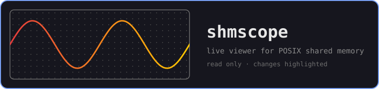

<div align="center">

# shmscope

</div>

<p align="center"></p>

A live terminal viewer for POSIX shared memory. Point it at a segment and watch
the bytes change while the writer runs.

Give it a layout file and the bytes read as fields instead of hex.

## Install

macOS only for now. Build it from source, you need CMake 4.2, a C++23
compiler and [uv](https://docs.astral.sh/uv/) for Conan.

```
uv sync
cmake --preset release
cmake --build --preset release
```

The binary ends up in `cmake-build-release/shmscope`.

## Try it

The repo has a small writer that fills a ring buffer:

```
./cmake-build-release/ring_writer &
./cmake-build-release/shmscope --layout examples/ring.ksy /shmscope-demo
```

Then `/field latest.body` to follow the newest record.

## Usage

```
shmscope [name] [--layout file] [--hz 1-60]
```

Without a name you get a launcher with your recent segments.

| Key | |
|---|---|
| arrows, PgUp/PgDn, Home/End | move |
| space | freeze |
| `f` | follow the writer |
| `i` | fields / inspector |
| `/` | commands, Tab completes |
| `q`, Esc | back |

Commands: `/jump <offset>`, `/field <path>`, `/layout <file|off|reload>`,
`/live`, `/reopen`. Type `/` to see the rest.

The mouse wheel scrolls whichever pane it's over. Hold Option to select text.

## Layouts

Layouts are [Kaitai Struct](https://kaitai.io) `.ksy` files, in YAML or JSON.
shmscope supports a subset: little endian, integers, floats, `str`, `contents`,
nested types, `instances` with `pos`, `repeat: expr` and `switch-on`.

Display formats are a shmscope extension:

```yaml
-shmscope-formats:
  price: {kind: scaled, digits: 4}
  side: {kind: enum, values: {1: buy, -1: sell}}

seq:
  - {id: price, type: s8, -shmscope-format: price}
```

Kinds are `decimal`, `hex`, `scaled`, `enum` and `timestamp`.
See [`examples/`](examples) for a full one.

## Notes

- The mapping is read only. shmscope never writes.
- Reads aren't synchronised with the writer, so a value can tear mid write.
- If the writer removes or recreates the segment, the title says so and
  `/reopen` picks up the new one.

## Tests

```
ctest --preset release
```

## License

This project is licensed under the Apache 2.0 License. See the [LICENSE](LICENSE) file for details.

